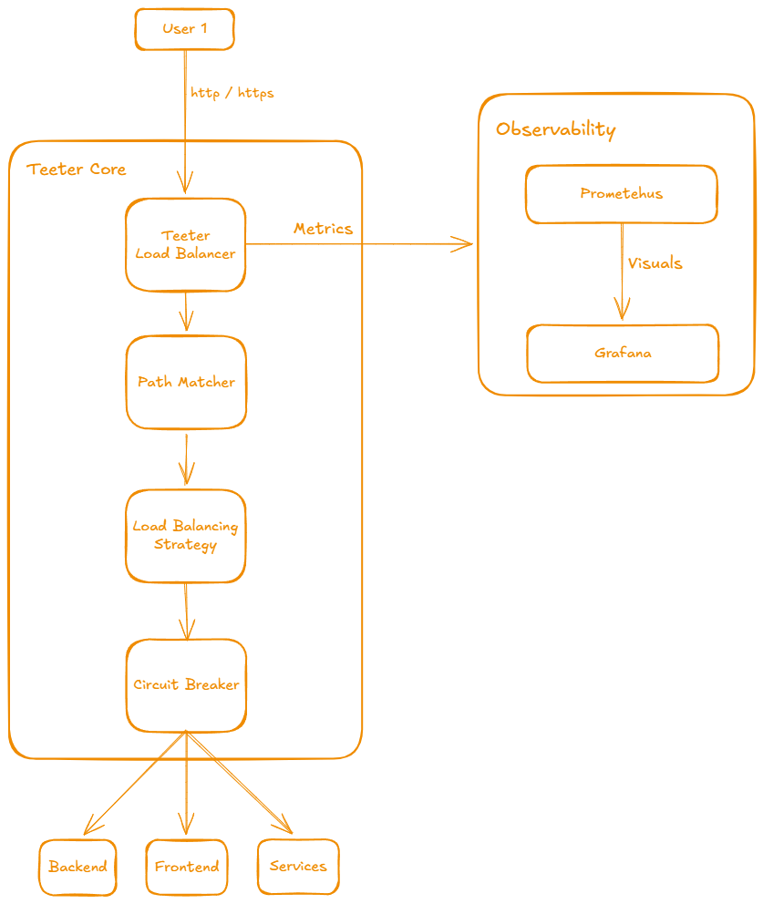

# Teeter: High-Performance L7 Load Balancer

## About Teeter
Teeter is a high-performance, production-ready Layer 7 Load Balancer and Reverse Proxy crafted in Go. Designed for microservices architecture, it bridges the gap between simplicity and industrial-strength resilience. Whether you're managing complex routing for a distributed system or ensuring zero-downtime for a single-page application, Teeter provides the stability of a seasoned proxy with the agility of a modern Go service.

Teeter is a lightweight, production-grade **Layer 7 (Application Layer) Load Balancer** and **Reverse Proxy** built in Go. It provides mission-critical traffic management features including path-based routing, multiple balancing strategies, active health checks, and circuit breaking—all with zero-trust resilience.

---

## System Architecture



---

## Key Features

- **Precision Routing**: Intelligent path matching (longest-prefix first) for microservices.
- **Advanced Strategies**: Supports Round Robin, Weighted Round Robin, and Least Connections.
- **Resilience Engine**: 
    - **Active Health Checks**: Continuous pings for real-time node availability.
    - **Circuit Breaker**: Automatically isolates failing nodes before they cause cascading failures.
    - **Retry Logic**: Configurable exponential backoff retries for transient 5xx errors.
- **Protocol Upgrade Support**: Native support for **WebSockets** and Next.js **Hot-Module Reloading (HMR)** via direct hijacking.
- **Native Monitoring**: Fully instrumented with Prometheus and pre-built Grafana dashboards.
- **Zero-Restart Admin API**: Add backends or check real-time status via simple JSON endpoints.

---

## HA & Resilience Mechanisms

Teeter is built to survive in "flaky" environments (like development in WSL/Docker).

### 1. WebSocket & HMR Bypass
Unlike standard proxies that break WebSockets during retries, Teeter detects `Upgrade` headers and **directly hijacks** the connection. This ensures your development environment's Hot-Reloading stays rock-solid even while traffic is being balanced.

### 2. Intelligent Circuit Breaker
If a backend times out or returns too many 502/503 errors, Teeter's circuit breaker opens.
- **Closed**: Normal operation.
- **Open**: Fail-fast mode (returns a 502 immediately without hitting the backend).
- **Half-Open**: Periodically tests the backend to see if it has recovered.

### 3. "No-Cache" Resilience
Teeter automatically injects `Cache-Control: no-cache, no-store, must-revalidate` on all error responses. This prevents browsers from "remembering" a temporary backend failure, ensuring a simple refresh (F5) works immediately after a service recovers.

---

## Quick Start

### Production (Docker-First)
The recommended way to run Teeter is using the pre-configured monitoring stack.

```bash
# 1. Start Teeter + Monitoring (Prometheus + Grafana)
docker-compose up --build -d

# 2. View Backend Health Dashboard
# Open http://localhost:3005 (Grafana default)
```

### Local Development
If you prefer running without Docker:

```bash
# Start Teeter pointing to your config
go run lb/cmd/lb/main.go -config config.yaml
```

---

## Configuration Guide (`config.yaml`)

Teeter configuration is clean and declarative.

```yaml
port: 1996          # LB entry point
admin_port: 1997     # Admin API & Metrics port

routes:
  - prefix: "/api/upload"
    strategy: "round_robin"
    backends:
      - url: "http://host.docker.internal:1994"
        timeout: 300s  # Support large file uploads

  - prefix: "/"
    strategy: "least_connections"
    backends:
      - url: "http://host.docker.internal:3000"
        timeout: 10s
```

---

## Monitoring & Admin API

### Prometheus Metrics
- **Port**: `:1997/metrics`
- **Key Metric**: `teeter_backend_status` (1 = Healthy, 0 = Down)

### Admin API
- **`GET /status`**: Full JSON report of backend health and failure counts.
- **`POST /add-backend`**: Dynamically join a backend to a route.

```bash
curl -X POST http://localhost:1997/add-backend \
  -H "Content-Type: application/json" \
  -d '{"prefix": "/", "url": "http://other-backend:3001"}'
```

---

*Teeter — Balancing your traffic with zero compromise.*

